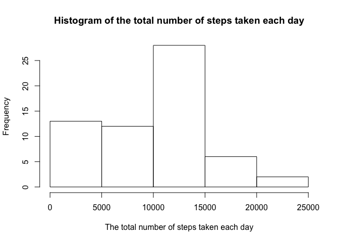
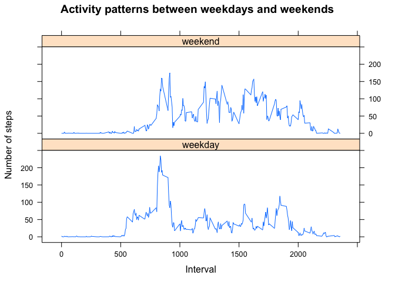

# Reproducible Research: Peer Assessment 1


## Loading and preprocessing the data

```r
act <- read.csv("activity.csv")
```

## What is mean total number of steps taken per day?

```r
library(dplyr)
```

```
## 
## Attaching package: 'dplyr'
## 
## The following objects are masked from 'package:stats':
## 
##     filter, lag
## 
## The following objects are masked from 'package:base':
## 
##     intersect, setdiff, setequal, union
```

```r
stepsperday <- group_by(act, date)
totalsteps <- summarize(stepsperday, steps = sum(steps, na.rm = TRUE))
hist(totalsteps$steps, main = "Histogram of the total number of steps taken each day", 
     xlab = "The total number of steps taken each day")
```

 

```r
meanstep <- format(mean(totalsteps$steps),digits = 6)
medianstep <-format(median(totalsteps$steps),digits = 6)
```
The mean of the total number of steps taken per day is 9354.23.

The median of the total number of steps taken per day is 10395.

## What is the average daily activity pattern?

```r
stepsperin <- group_by(act, interval)
meanstepsin <- summarize(stepsperin, steps = mean(steps, na.rm = TRUE))
plot(meanstepsin,type = "l",xlab = "Interval",ylab="Steps",main="Average daily activity pattern")
```

 

```r
maxstepin <- meanstepsin[meanstepsin$steps == max(meanstepsin$steps),]$interval
nextvalue <- maxstepin + 5
```
The 5-minute interval 835 ~ 840, on average across all the days in the dataset, contains the maximum number of steps.

## Imputing missing values

```r
summissing <- sum(!complete.cases(act))
```
The total number of missing values in the dataset is 2304.

Here, the mean for the 5-minute interval is used for filling in the missing values.

```r
fillact <- act
tt <- meanstepsin[meanstepsin$interval == fillact$interval[is.na(fillact$steps)],]
fillact$steps <- replace(fillact$steps,is.na(fillact$steps),tt$steps)
fstepsperday <- group_by(fillact, date)
ftotalsteps <- summarize(fstepsperday, steps = sum(steps, na.rm = TRUE))
hist(ftotalsteps$steps, main = "Histogram of the total number of steps with imputed missing values", xlab = "The total number of steps taken each day")
```

 

```r
fmeanstep <- format(mean(ftotalsteps$steps),digits = 6)
fmedianstep <- format(median(ftotalsteps$steps),digits = 6)
```
The mean of the total number of steps taken per day is 9530.72.

The median of the total number of steps taken per day is 10439.

From the results above, these values differ from the estimates without imputing missing data. Imputing missing data will leads to inaccuracy on the estimates of the total daily number of steps.


## Are there differences in activity patterns between weekdays and weekends?

```r
library(lubridate)
act <- mutate(act,wday(as.Date(act$date)))
names(act) = c("steps","date","interval","weekdays")
act$weekdays = ifelse(act$weekdays == 1 |act$weekdays == 7, "weekend","weekday")
wstepsperin <- group_by(act,interval,weekdays)
wmeanstepsin <- summarize(wstepsperin, steps = mean(steps, na.rm = TRUE))
library(lattice)
xyplot( steps~ interval | weekdays, data = wmeanstepsin, layout = c(1, 2),type="l", main = "Activity patterns between weekdays and weekends",xlab = "Interval", ylab = "Number of steps")
```

 

From the figure above, there are differences in activity patterns between weekdays and weekends.
